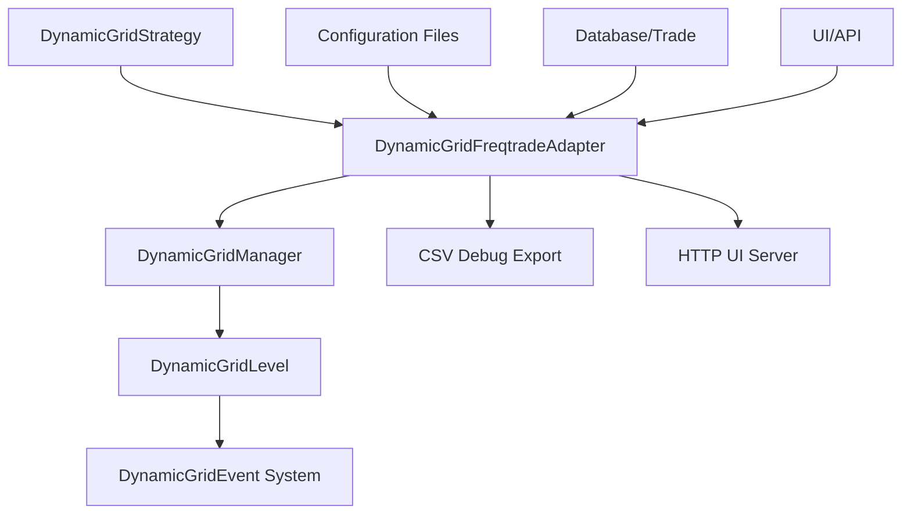
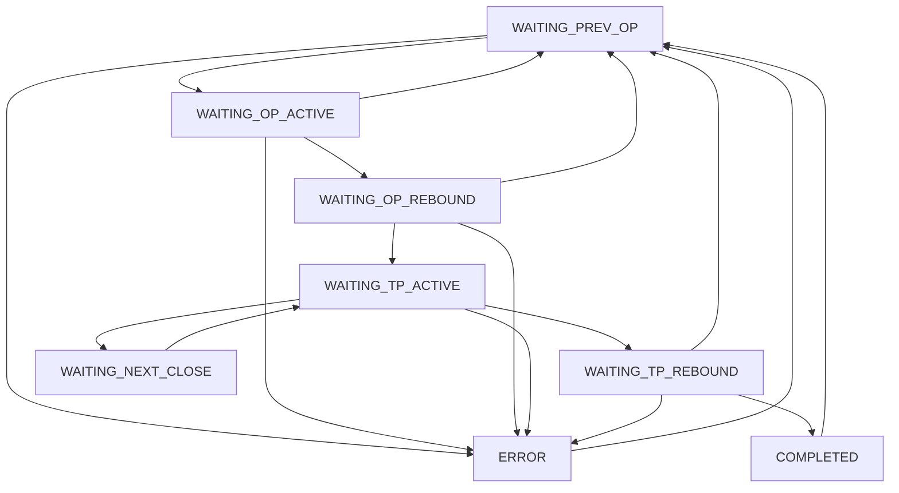

# DynamicGrid设计说明

## 1. 策略概述

**DynamicGridStrategy** 是一种基于多层级网格交易的高级量化策略，采用事件驱动架构，专为高波动性的加密货币市场设计。该策略结合多时间框架技术指标（CCI、RSI），通过智能回调机制和动态极值跟踪，实现精确的多层级网格交易，适配 Freqtrade 框架。

### 核心特点
- **事件驱动架构**：完全基于事件系统（`DynamicGridEvent`）处理价格更新、信号生成和交易执行，实现高度解耦的模块化设计。
- **多指标择时**：支持 CCI 和 RSI 指标的多时间框架组合，灵活配置开仓条件。
- **智能网格系统**：支持多级网格（可配置层数），每级配置独立的投资金额、开仓比例和止盈比例。
- **层级依赖管理**：通过检查前一层是否已开仓来控制当前层级的状态流转和交易执行。
- **智能回调机制**：基于最低价/最高价动态计算反弹价格，支持做多/做空双向策略。
- **防重复触发**：通过 `_pending_action` 和 `_pending_since` 标记避免重复发送交易信号。
- **状态一致性校验**：多重校验机制确保层级间逻辑关系正确。
- **全局风险控制**：支持价格比例止盈、金额止盈、金额止损三种全局退出模式。
- **配置热更新**：支持 JSON 配置的加载、保存和运行时热更新。
- **内置 UI 管理**：提供 HTTP API 服务器，支持实时配置管理和状态监控。
- **完整调试支持**：CSV 格式调试数据导出，包含所有关键状态和决策信息。

## 2. 策略核心架构

### 2.1 系统架构概览



### 2.2 多指标择时逻辑

#### 支持的技术指标
1. **CCI (Commodity Channel Index)**
   - 支持多时间框架：`1m`, `5m`, `15m`, `1h`, `4h`
   - 可配置周期长度（默认 14）
   - 可配置多头/空头阈值
   - 使用 TA-Lib 的 `ta.CCI` 函数计算

2. **RSI (Relative Strength Index)**
   - 支持多时间框架：`1m`, `5m`, `15m`, `1h`, `4h`
   - 可配置周期长度（默认 14）
   - 可配置多头/空头阈值
   - 使用 TA-Lib 的 `ta.RSI` 函数计算

#### 开仓信号逻辑
- **智能方向识别**：根据网格配置的 `is_short` 自动选择对应方向的信号
- **多指标组合**：要求所有启用指标条件同时满足才触发开仓
- **动态条件构建**：基于配置文件动态构建开仓条件列表
- **开仓标签**：统一使用 `add:l0` 标识第0层开仓

```python
# 多头网格示例
if not is_short:  # 多头网格，只检查多头信号
    long_conditions.append(dataframe[f'cci_{cci_length}_{cci_timeframe}'] < cci_long_threshold)
    long_conditions.append(dataframe[f'rsi_{rsi_length}_{rsi_timeframe}'] < rsi_long_threshold)
```

### 2.3 网格系统核心逻辑

#### 网格层级结构
每个网格管理器包含 `n_levels` 个网格级别（`DynamicGridLevel` 实例），每级独立配置：

- **投资金额**（`amount`）：每级投资金额，支持基础币（`base`）或计价币（`quote`）模式
- **开仓比例**（`op_ratios`）：相对于前一层开仓价格的偏移比例
- **止盈比例**（`tp_ratios`）：触发止盈的价格偏移比例
- **开仓回调比例**（`op_rebound_ratios`）：开仓前允许的价格回调比例
- **止盈回调比例**（`tp_rebound_ratios`）：止盈激活后允许的价格回调比例

#### 智能回调机制
- **动态极值跟踪**：仅在回调状态（`WAITING_OP_REBOUND`、`WAITING_TP_REBOUND`）追踪最高/最低价
- **智能重置机制**：状态变化时自动重置极值，避免过时数据影响
- **双向支持**：
  - 做多：基于最低价向上反弹计算开仓价格
  - 做空：基于最高价向下反弹计算开仓价格

```python
# 做多开仓反弹价格计算
if not self.is_short:
    rebound_price = self._min_price * (1 + op_rebound_ratio)
# 做空开仓反弹价格计算  
else:
    rebound_price = self._max_price * (1 - op_rebound_ratio)
```

#### 状态机架构
每个网格级别采用严格的状态机管理，包含 8 个核心状态：

1. **`WAITING_PREV_OP`**：等待前一层开仓（非第一层专用）
2. **`WAITING_OP_ACTIVE`**：等待开仓激活条件
3. **`WAITING_OP_REBOUND`**：等待开仓回调确认
4. **`WAITING_TP_ACTIVE`**：已开仓，等待止盈激活
5. **`WAITING_TP_REBOUND`**：止盈激活，等待回调平仓
6. **`WAITING_NEXT_CLOSE`**：等待后续层级平仓
7. **`COMPLETED`**：平仓完成
8. **`ERROR`**：错误状态，需要处理和恢复

#### 状态流转图

#### 状态转换规则表
| 当前状态 | 合法下一状态 |
|---------|-------------|
| WAITING_PREV_OP | WAITING_OP_ACTIVE, WAITING_TP_ACTIVE, ERROR |
| WAITING_OP_ACTIVE | WAITING_OP_REBOUND, WAITING_PREV_OP, WAITING_TP_ACTIVE, ERROR |
| WAITING_OP_REBOUND | WAITING_TP_ACTIVE, WAITING_PREV_OP, ERROR |
| WAITING_TP_ACTIVE | WAITING_TP_REBOUND, WAITING_NEXT_CLOSE, WAITING_PREV_OP, ERROR |
| WAITING_TP_REBOUND | COMPLETED, WAITING_PREV_OP, ERROR |
| WAITING_NEXT_CLOSE | WAITING_TP_ACTIVE, WAITING_PREV_OP, ERROR |
| COMPLETED | WAITING_PREV_OP, ERROR |
| ERROR | WAITING_PREV_OP |

### 2.4 防重复触发机制

为确保策略执行稳定性，系统实现了智能的防重复触发机制：

- **`_pending_action`**：标记当前待处理的动作类型（`'add'` | `'reduce'` | `None`）
- **`_pending_since`**：记录挂单开始时间戳
- **幂等性保证**：在同一价格条件下避免重复发送交易信号
- **超时管理**：显示等待时长，便于监控挂单状态

```python
# 防重复加仓示例
if price_triggered:
    if self._pending_action == "add":
        self.logger.debug(f"跳过加仓待处理|层级={self.level_id}")
        return events
    # 发送加仓信号并设置待处理标记
    self._pending_action = "add"
    self._pending_since = current_time.timestamp()
```

### 2.5 状态一致性校验系统

管理器提供多重校验机制确保层级间逻辑关系正确：

1. **前后层级一致性校验**：验证层级间的依赖关系
2. **单级内部状态校验**：检查每个层级的内部状态合理性
3. **全局状态一致性校验**：整体状态协调和验证
4. **级联状态更新**：智能的状态级联修复机制
  - **状态联动**：
    - **开仓联动**：
      - 第一层（`level_id=0`）收到 `DynamicGridSignalEvent`（如 CCI 信号）或满足 `op_ratios[0]` 条件后，若 `first_level_op=True`，状态从 `WAITING_PREV_OPEN` 直接转为 `WAITING_TP_ACTIVE`；否则转为 `WAITING_OP_ACTIVE`，等待价格回撤。
      - 其他层级需前一层开仓后，从 `WAITING_PREV_OPEN` 转为 `WAITING_OP_ACTIVE`，基于 `op_ratios[i]` 计算目标开仓价格。
      - 开仓成功后，当前层状态转为 `WAITING_TP_ACTIVE`，前一层转为 `WAITING_NEXT_CLOSE`，后一层转为 `WAITING_OP_ACTIVE`。
    - **平仓联动**：
      - 平仓成功后，当前层状态从 `WAITING_TP_REBOUND` 转为 `COMPLETED`，然后重置为 `WAITING_PREV_OPEN`。
      - 前一层从 `WAITING_NEXT_CLOSE` 恢复为 `WAITING_TP_ACTIVE`，后一层从 `WAITING_OP_ACTIVE` 转为 `WAITING_PREV_OPEN`。
    - **错误处理**：
      - 无效状态转换（如从 `WAITING_OP_ACTIVE` 到非法状态）触发 `ERROR` 状态，记录日志并暂停该层级操作。
    - 开仓从前到后（层级 0 到 n-1），平仓从后到前（层级 n-1 到 0）。
- **开仓逻辑**：
  - **第一层（level_id=0）**：
    - 若 `use_cci_signal=True`，CCI < -100（多头）或 > 100（空头）触发 `DynamicGridSignalEvent`。
    - 若 `first_level_op=True`，直接开仓，状态转为 `WAITING_TP_ACTIVE`。
    - 否则，基于当前价格和 `op_ratios[0]` 计算目标开仓价格，状态转为 `WAITING_OP_ACTIVE`。
    - 价格回撤至 `target_open_price * (1 ± op_rebound_ratios[0])`，触发 `DynamicGridOpenTriggerEvent`，状态转为 `WAITING_TP_ACTIVE`。
  - **后续层（level_id=1 to n_levels-1）**：
    - 前一层开仓后，状态从 `WAITING_PREV_OPEN` 转为 `WAITING_OP_ACTIVE`。
    - 触发条件：
      - 多头：当前价格 ≤ 上一层开仓价格 * `(1 - op_ratios[i])`。
      - 空头：当前价格 ≥ 上一层开仓价格 * `(1 + op_ratios[i])`。
    - 价格回撤至 `target_open_price * (1 ± op_rebound_ratios[i])`，触发开仓，状态转为 `WAITING_TP_ACTIVE`。
- **平仓逻辑**：
  - **追踪止盈**：
    - 触发条件：
      - 多头：价格 ≥ 开仓价格 * `(1 + tp_ratios[i])`，记录最高价（`max_price`）。
      - 空头：价格 ≤ 开仓价格 * `(1 - tp_ratios[i])`，记录最低价（`min_price`）。
    - 平仓：价格回撤至 `max_price * (1 - tp_rebound_ratios[i])`（多头）或 `min_price * (1 + tp_rebound_ratios[i])`（空头），触发 `DynamicGridCloseTriggerEvent`，状态转为 `COMPLETED`。
  - **全局止盈/止损**：
    - 全局止盈：总未实现收益（`unrealized_pnl`）≥ `global_tp_amount_target`，触发 `DynamicGridCloseTriggerEvent`。
    - 全局止损：总未实现损益（`unrealized_pnl`）≤ `global_sl_amount_target`，触发 `DynamicGridCloseTriggerEvent`。
- **资金管理**：
  - **投资金额**：`amount[i]` 指定每层金额，单位由 `amount_mode`（`"base"` 或 `"quote"`）决定。
  - **动态计算**：`custom_stake_amount` 方法计算计价币金额：
    - 若 `amount_mode="quote"`：`stake = amount[i]`。
    - 若 `amount_mode="base"`：`stake = amount[i] * current_rate`。

### 2.3 事件驱动机制
- **事件类型**：
  - **`DynamicGridDataUpdateEvent`**：
    - **触发条件**：接收新的 K 线数据（OHLCV）。
    - **数据字段**：`pair`（交易对）、`close`（收盘价）、`timestamp`（时间戳）。
    - **作用**：更新网格级别的价格极值（`max_price`、`min_price`），检查开仓/平仓条件。
    - **日志**：`DEBUG` 记录价格更新，`INFO` 记录触发状态变化。
  - **`DynamicGridSignalEvent`**：
    - **触发条件**：CCI 信号满足阈值（多头：CCI < -100；空头：CCI > 100）或禁用 CCI 信号时的价格条件。
    - **数据字段**：`pair`、`is_short`（方向）、`timestamp`。
    - **作用**：触发第一层开仓。
    - **日志**：`INFO` 记录信号生成，`DEBUG` 记录 CCI 值。
  - **`DynamicGridOpenTriggerEvent`**：
    - **触发条件**：价格满足开仓条件（`target_open_price * (1 ± op_rebound_ratios[i])`）。
    - **数据字段**：`pair`、`level_id`、`is_short`、`base_amount`（基础币数量）、`target_price`（目标价格）、`timestamp`。
    - **作用**：触发市价单开仓。
    - **日志**：`INFO` 记录开仓触发，`DEBUG` 记录目标价格。
  - **`DynamicGridCloseTriggerEvent`**：
    - **触发条件**：价格满足止盈（`max_price * (1 - tp_rebound_ratios[i])` 或 `min_price * (1 + tp_rebound_ratios[i])`）或全局止盈/止损条件。
    - **数据字段**：`pair`、`level_id`、`reason`（"tp" 或 "sl"）、`base_amount`、`target_price`、`timestamp`。
    - **作用**：触发市价单平仓。
    - **日志**：`INFO` 记录平仓触发，`DEBUG` 记录原因和价格。
  - **`DynamicGridOpenSuccessEvent`**：
    - **触发条件**：开仓订单执行成功。
    - **数据字段**：`pair`、`level_id`、`is_short`、`base_amount`、`executed_price`（实际成交价）、`timestamp`。
    - **作用**：更新网格级别的开仓价格（`op_price`）和状态。
    - **日志**：`INFO` 记录开仓成功。
  - **`DynamicGridCloseSuccessEvent`**：
    - **触发条件**：平仓订单执行成功。
    - **数据字段**：`pair`、`level_id`、`reason`、`base_amount`、`executed_price`、`timestamp`。
    - **作用**：更新收益/损失（`realized_profit`/`realized_loss`）并重置状态。
    - **日志**：`INFO` 记录平仓成功和收益。
  - **`DynamicGridStateChangeEvent`**：
    - **触发条件**：网格级别状态发生变化（如从 `WAITING_OP_ACTIVE` 到 `WAITING_OP_REBOUND`）。
    - **数据字段**：`level_id`、`from_state`、`to_state`、`timestamp`。
    - **作用**：记录状态转换，触发前后层级状态更新。
    - **日志**：`INFO` 记录状态转换，`DEBUG` 记录转换条件。
- **事件处理流程**：
  - `DynamicGridAdapter` 接收 K 线数据或 CCI 信号，生成 `DynamicGridDataUpdateEvent` 或 `DynamicGridSignalEvent`。
  - `DynamicGridManager` 分发事件到对应 `DynamicGridLevel`，根据状态机处理事件，生成 `DynamicGridOpenTriggerEvent`、`DynamicGridCloseTriggerEvent` 或 `DynamicGridStateChangeEvent`。
  - 订单执行后，生成 `DynamicGridOpenSuccessEvent` 或 `DynamicGridCloseSuccessEvent`，更新状态和收益。
  - 日志示例：
    ```
    2025-08-23 21:05:00 - DynamicGridStrategy - INFO - 生成多头信号: pair=BTC/USDT, CCI=-120
    2025-08-23 21:05:01 - DynamicGridLevel_0 - DEBUG - 检查开仓价格: 当前=50000, 目标=50000
    2025-08-23 21:05:01 - DynamicGridLevel_0 - INFO - 状态转换: WAITING_PREV_OPEN -> WAITING_TP_ACTIVE
    2025-08-23 21:05:02 - DynamicGridAdapter - INFO - 开仓成功: pair=BTC/USDT, level_id=0, 价格=50000, 数量=0.004 BTC
    ```

## 3. 策略参数配置

### 3.1 基础参数
| 参数 | 类型 | 默认值 | 描述 |
|------|------|---------|------|
| `pair` | str | 必填 | 交易对，如 "BTC/USDT" |
| `is_short` | bool | false | 是否为空头交易 |
| `enabled` | bool | true | 是否启用该网格管理器 |
| `n_levels` | int | 5 | 网格层数 |
| `amount_mode` | str | "quote" | 金额单位（"base" 或 "quote"） |

### 3.2 网格参数（列表类型，长度必须等于 n_levels）
| 参数 | 类型 | 示例默认值 | 描述 |
|------|------|-------------|------|
| `amount` | List[float] | [200.0, 200.0, 200.0, 200.0, 200.0] | 每层投资金额 |
| `op_ratios` | List[float] | [0.0, 0.005, 0.01, 0.015, 0.02] | 每层开仓偏移比例 |
| `tp_ratios` | List[float] | [0.02, 0.025, 0.03, 0.035, 0.04] | 每层止盈激活比例 |
| `op_rebound_ratios` | List[float] | [0.002, 0.002, 0.002, 0.002, 0.002] | 每层开仓回调比例 |
| `tp_rebound_ratios` | List[float] | [0.005, 0.005, 0.005, 0.005, 0.005] | 每层止盈回调比例 |

### 3.3 全局控制参数
| 参数 | 类型 | 默认值 | 描述 |
|------|------|---------|------|
| `enable_global_tp_price_ratio_check` | bool | true | 是否启用价格比例止盈 |
| `global_tp_price_ratio` | float | null | 全局价格比例止盈阈值 |
| `enable_global_tp_amount_check` | bool | false | 是否启用金额止盈 |
| `global_tp_amount_target` | float | null | 全局金额止盈目标 |
| `enable_global_sl_amount_check` | bool | false | 是否启用金额止损 |
| `global_sl_amount_target` | float | null | 全局金额止损目标 |
| `skip_first_level_rebound` | bool | true | 是否跳过第0层激活 |
| `skip_levels_exit_number` | int | 0 | 跳过前 N 层的内部止盈 |

### 3.4 技术指标参数

#### CCI 指标配置
| 参数 | 类型 | 默认值 | 描述 |
|------|------|---------|------|
| `use_signal` | bool | false | 是否启用 CCI 信号 |
| `timeframe` | str | "15m" | CCI 计算时间框架 |
| `cci_length` | int | 14 | CCI 计算周期 |
| `cci_long_threshold` | float | -100 | CCI 多头信号阈值 |
| `cci_short_threshold` | float | 100 | CCI 空头信号阈值 |

#### RSI 指标配置
| 参数 | 类型 | 默认值 | 描述 |
|------|------|---------|------|
| `use_signal` | bool | false | 是否启用 RSI 信号 |
| `timeframe` | str | "5m" | RSI 计算时间框架 |
| `rsi_length` | int | 14 | RSI 计算周期 |
| `rsi_long_threshold` | float | 30 | RSI 多头信号阈值 |
| `rsi_short_threshold` | float | 70 | RSI 空头信号阈值 |

## 4. 配置示例

### 4.1 JSON 配置文件示例

```json
{
  "pairs": [
    {
      "pair": "BTC/USDT",
      "is_short": false,
      "enabled": true,
      "n_levels": 3,
      "amount": [200.0, 200.0, 200.0],
      "op_ratios": [0.0, 0.01, 0.02],
      "tp_ratios": [0.02, 0.025, 0.03],
      "op_rebound_ratios": [0.002, 0.002, 0.002],
      "tp_rebound_ratios": [0.005, 0.005, 0.005],
      "enable_global_tp_price_ratio_check": true,
      "global_tp_price_ratio": 0.05,
      "enable_global_tp_amount_check": false,
      "enable_global_sl_amount_check": false,
      "amount_mode": "quote",
      "skip_first_level_rebound": true,
      "skip_levels_exit_number": 0
    }
  ],
  "signals": {
    "cci": {
      "use_signal": true,
      "timeframe": "15m",
      "cci_length": 14,
      "cci_long_threshold": -100,
      "cci_short_threshold": 100
    },
    "rsi": {
      "use_signal": true,
      "timeframe": "5m",
      "rsi_length": 14,
      "rsi_long_threshold": 30,
      "rsi_short_threshold": 70
    }
  }
}
```

### 4.2 Freqtrade 主配置示例

```json
{
  "strategy": "DynamicGridStrategy",
  "dynamicgrid_config_path": "copy_config.json",
  "dynamicgrid_debug_export": true,
}
```

## 5. 风险管理与监控

### 5.1 多层风险控制
- **全局价格比例止盈**：基于平均成本与当前价的相对收益率
- **全局金额止盈**：基于总净盈亏的绝对金额目标
- **全局金额止损**：基于总净盈亏的绝对亏损限制
- **层级止盈**：每个层级独立的追踪止盈机制
- **状态监控**：自动检测和恢复错误状态

### 5.2 实时监控工具

#### HTTP API 管理界面
- **配置管理**：`GET/POST /dynamicgrid/config`
- **实时状态**：`GET /dynamicgrid/status`
- **热更新**：`POST /dynamicgrid/reload`
- **静态界面**：`GET /` (内置 UI)

#### CSV 调试导出
自动导出关键状态数据，包含：
- 时间戳和可读时间
- 交易对和当前价格
- 每个层级的状态和价格数据
- 出入事件和决策信息

### 5.3 异常处理
- **订单失败恢复**：自动转入 ERROR 状态并恢复
- **状态不一致修复**：多重校验机制自动修复层级间逻辑错误
- **配置验证**：使用 Pydantic 进行全面的参数验证
- **部分成交处理**：防止重复累计的增量处理机制

## 6. 性能优化与最佳实践

### 6.1 性能优化
- **计算属性设计**：所有聚合数据都是计算属性，确保实时性
- **事件并行处理**：支持多个网格管理器并行运行
- **状态缓存优化**：最小化状态转换和验证开销

### 6.2 最佳实践
1. **参数调优**：
   - 从小金额开始测试，逐步增加仓位
   - 根据市场波动性调整回调比例
   - 合理设置层级数量和间距

2. **风险控制**：
   - 始终启用全局止损机制
   - 设置合理的仓位规模限制
   - 定期检查策略表现和参数效果

3. **监控调试**：
   - 在测试环境中启用详细日志
   - 使用 CSV 导出分析策略表现
   - 通过 UI API 实时监控网格状态

## 7. 技术架构总结

### 7.1 模块化设计
- **策略层** (`DynamicGridStrategy`)：Freqtrade 接口层
- **适配器层** (`DynamicGridFreqtradeAdapter`)：事件转换和状态管理
- **管理器层** (`DynamicGridManager`)：多层级协调和一致性校验
- **执行层** (`DynamicGridLevel`)：单个层级的状态机实现
- **事件层** (`DynamicGridEvent`)：统一的事件系统
- **配置层** (`DynamicGridConfig`)：类型安全的配置管理

### 7.2 设计优势
1. **高度解耦**：每个模块职责单一，易于测试和维护
2. **事件驱动**：完全异步的事件处理，高度可扩展
3. **状态安全**：严格的状态机和多重校验机制
4. **灵活配置**：支持热更新和实时调整
5. **全面监控**：丰富的调试和监控工具

**文档版本**：v2.0  
**更新日期**：2024年第四季度  
**技术架构**：基于 Freqtrade v2024.x 的事件驱动网格策略